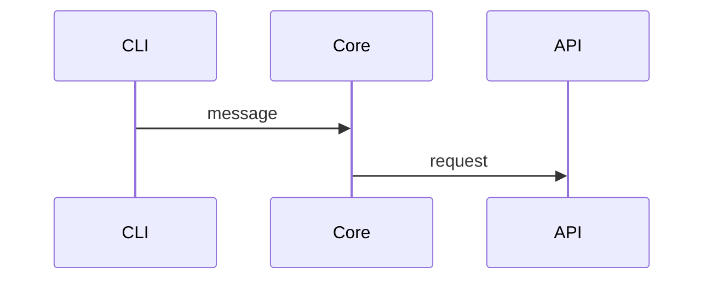
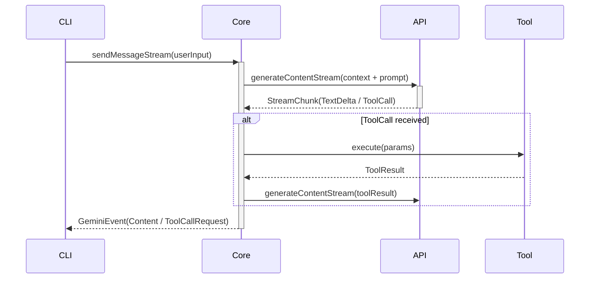

# DeepWiki Creator

ローカルのコードベースを深く分析し、以下を自動生成するスキルです：

1. **Wiki構造（_meta.json）** - リポジトリ全体の論理的なセクション・ページ構成
2. **各ページのMarkdownドキュメント** - コードの実装に基づく詳細な解説とコードスニペット
3. **Mermaid図** - アーキテクチャ図、データフロー図、シーケンス図、クラス図
4. **ナビゲーション用 index.md** - 全ページのリンク付き目次

## 前提条件

- 対象リポジトリがローカルに存在すること
- シェルコマンド（`find`, `wc`, `cat`, `head`, `grep`）が利用可能であること

## 品質目標

**「このWikiを読めば、コードを直接読まなくてもモジュールの設計意図と実装方針を理解でき、
修正箇所の目星がつく」** レベルのドキュメントを生成する。

以下は品質不足とみなす：
- 「〇〇クラスは△△を管理します」だけで終わっている（What止まり。HowとWhyが欠如）
- コードスニペットが1つもない（具体性がない）
- 正常系の説明のみでエラーハンドリングに触れていない（実用性がない）
- 複数ページで同じコンポーネントを説明している（構造設計の失敗）
- 60行未満のページがある（薄すぎる）
- 設計判断の理由（なぜその方式を選んだか）に触れていない（Whyの欠如）
- モジュールを横断する処理フローの記述がどこにもない
- **Comprehensiveモードでページ数が15未満**（カバレッジ不足）

## アーキテクチャ：サブエージェント委譲

**v4ではStep 3（ページ生成）をサブエージェントに委譲する。**

メインエージェントのコンテキストで全ページを逐次生成すると、後半のページほど
コンテキストが枯渇して品質が劣化する。各ページの生成を独立したサブエージェントに
委譲することで、全ページが同等の品質で生成される。

```
メインエージェント:
  Step 0: パラメータ確認
  Step 1: ファイル収集
  Step 1.5: コード偵察
  Step 2: Wiki構造設計 + 一貫性ガイド生成
  Step 4: index.md 生成
  Step 5: 検証

サブエージェント（agents/page-writer.md — ページごとに起動）:
  Step 3: 1ページのMarkdown生成
  入力: ページ定義 + relevant_files パス + 一貫性ガイド
  出力: 完成したMarkdownファイル（ファイルに書き出し）
```

**サブエージェントが利用できない場合は、メインエージェントが直接 Step 3 を実行してよい。**
その場合、ページを1つ生成するたびに前のページの relevant_files 内容を
コンテキストから解放し、品質の均一化に努める。

## ワークフロー

### Step 0: パラメータ確認

ユーザーに以下を確認する（未指定の場合はデフォルトを使用）：

| パラメータ | デフォルト | 選択肢 |
|-----------|-----------|--------|
| 対象リポジトリ | カレントディレクトリ | 任意のローカルパス |
| 出力先 | `./wiki-output` | 任意のパス |
| 出力言語 | `en` | `ja`, `zh`, `ko`, `es` 等 |
| 生成モード | `comprehensive` | `concise` |
| 対象ディレクトリ制限 | なし（全体） | カンマ区切りで指定 |
| Mermaid図生成 | 有効 | 無効にも可 |

### Step 1: ファイル収集とフィルタリング

```bash
bash <skill_path>/scripts/collect_files.sh <REPO_PATH> [INCLUDE_DIRS]
```

出力：
- `/tmp/deepwiki_files.txt` - フィルタ済みファイル一覧
- `/tmp/deepwiki_tree.txt` - ツリー形式のファイル構造
- `/tmp/deepwiki_readme.md` - README.mdの内容

**注意**: `file_filters.json` の `max_file_size_kb`（デフォルト100KB）を超えるファイルはスキップされる。
大規模なソースファイルが除外される場合は、この値を調整すること。

### Step 1.5: コード偵察（Code Reconnaissance）

**省略してはならない。Wiki品質の最大の決定要因。**

```bash
bash <skill_path>/scripts/recon_code.sh <REPO_PATH> [INCLUDE_DIRS]
```

出力：`/tmp/deepwiki_recon.md`

偵察レポートの構成：
1. **エントリーポイントと設定ファイル** - package.json, pyproject.toml 等の主要フィールド
2. **Export / Public API 一覧** - 各ソースファイルのクラス・関数シグネチャ
3. **拡張機構の検出** - プラグイン、スキル、フック、ルーティング、デコレータ等
4. **モジュール間依存関係** - import/from による内部依存マップ
5. **ディレクトリ別サマリー** - ファイル数と主要拡張子

### Step 2: Wiki構造の設計

以下の **3つ全て** を入力として読み込む：
1. `/tmp/deepwiki_tree.txt`（ファイル構造）
2. `/tmp/deepwiki_readme.md`（README）
3. `/tmp/deepwiki_recon.md`（コード偵察結果）

`references/structure_prompt.md` のガイドラインに従ってWiki構造のJSONを生成する。

**出力は有効なJSON** であること。コメントやトレーリングカンマは禁止。
ファイルパスは偵察結果で確認済みの実在パスのみ。

#### 出力ディレクトリ構造

```
{OUTPUT_DIR}/
├── _meta.json                    # Wiki構造定義
├── _consistency_guide.md         # 用語辞書・クロスリファレンス
├── index.md                      # 目次（テーブル形式）
└── sections/
    ├── {section_id}/
    │   ├── {page_id}.md
    │   └── {page_id}.md
    └── {section_id}/
        └── {page_id}.md
```

#### Step 2.5: 一貫性ガイドの生成

_meta.json 確定後、サブエージェントに渡す **一貫性ガイド** を生成する。
これは `<OUTPUT_DIR>/_consistency_guide.md` に保存する。

**生成アルゴリズム：**
1. **用語辞書**: 偵察結果のexport名、README内のキーワード、設定ファイルの項目名から
   プロジェクト固有の用語を抽出し、正式表記と説明を定義する
2. **クロスリファレンス**: `_meta.json` の `related_pages` フィールドと
   `relevant_files` の共有関係から、ページ間の参照パターンを決定する
3. **共通ルール**: 出力言語に応じたMermaidラベルのクォートルール等を記載する

一貫性ガイドの内容：

```markdown
# 一貫性ガイド（Wiki内部用）

## 用語辞書
| 用語 | 正式表記 | 説明 |
|------|---------|------|
| ツール呼び出し | Tool Call | モデルがツールの実行を要求すること |
| ...  | ...     | ... |

## ページ間クロスリファレンス
| ページID | 主担当トピック | 他ページで言及する際の書き方 |
|---------|--------------|--------------------------|
| chat-session | GeminiChat, Turn | 「詳細は [チャットセッション管理](../core/chat-session.md) を参照」 |
| ...     | ...           | ...                       |

## 共通ルール
- コードスニペットは {language} タグ必須
- 日本語Mermaidラベルはクォート必須
- 他ページの担当コンポーネントは説明せず、リンクで参照する
```

#### 構造設計時の必須チェック

**1. カバレッジ検証**
偵察結果の export と、全ページの relevant_files を突合する。

**2. 拡張機構の検出**
偵察結果セクション3（拡張機構）に検出があれば、解説ページを **必ず** 含める。
加えて、偵察では検出しきれない拡張ポイント（コード内で外部ファイルをロードして
機能を追加する仕組み）がないか、README等から確認する。

**3. エンドツーエンドフローページの必須化（Comprehensiveモード）**
「ユーザー入力から最終出力まで」のモジュール横断フローを解説するページを
**少なくとも1つ** 含めること（例: `end-to-end-flow`, `request-lifecycle` 等）。
このページは特定のモジュールに属さず、複数のコンポーネントがどう連携するかを示す。

**4. 重複検証**
**5. 粒度検証**
**6. JSON構文チェック**

### Step 3: ページコンテンツの生成（サブエージェント委譲）

_meta.json の各ページに対して、**`page-writer` サブエージェントを起動**する。

**サブエージェントの呼び出し方：**

各ページについて以下のプロンプトで page-writer エージェントに委譲する：

```
以下のWikiページを生成してください。

## ページ定義
{_meta.json の当該ページエントリをJSON形式で貼り付け}

## パラメータ
- repo_path: {REPO_PATH}
- output_path: {OUTPUT_DIR}/sections/{section.id}/{page.id}.md
- consistency_guide_path: {OUTPUT_DIR}/_consistency_guide.md
- page_prompt_path: {SKILL_PATH}/references/page_prompt.md
- language: {LANGUAGE}
```

**relevant_files の上限：**
- 通常ページ: 最大8ファイル（`file_filters.json` の `max_files_per_page`）
- エンドツーエンドフローページ: 最大10ファイル（横断的に指定可）

**委譲の順序：**
1. まずエンドツーエンドフローページを生成（他ページからの参照先になるため）
2. importance: high のページを生成
3. importance: medium, low のページを生成

**サブエージェントが利用できない環境の場合（2パス戦略）：**

メインエージェントが直接ページを生成する。ただし、コンテキスト枯渇による
ページ数削減を防ぐため、以下の **2パス戦略** で実行する。

**パス1（骨格生成）**: 全ページについて、ページファイルを作成し **骨格のみ** を書く。
骨格は以下の要素のみ（各ページ30〜40行程度）：
- タイトルと概要（2〜3文）
- Mermaid図（1つ）
- 主要コンポーネント名と責務の一覧（詳細なしで名前と1行説明のみ）
- 設計判断のキーワード（後で肉付けするための見出しレベル）
- 生成元ファイル一覧

**パス2（肉付け）**: 各ページについて relevant_files を `cat` で読み込み、
骨格を60行以上の完全なページに仕上げる。コードスニペット、メソッドシグネチャ、
エラーハンドリング詳細、設計判断のWhyを追記する。

この2パス方式により：
- パス1で全ページの存在が保証される（カバレッジ確保）
- パス2で各ページのコードを読みながら深掘りできる（品質確保）
- コンテキスト枯渇時でもパス1の骨格がベースラインとして残る

**パス間の品質ゲート（必須）：**

パス1完了後、パス2に進む前に以下を検証する。
**1つでも不合格の項目があれば、パス2で該当ページを優先的に肉付けすること。**

```bash
# 全ページの行数チェック
for md_file in $(find "$OUTPUT_DIR/sections" -name "*.md" -type f); do
  line_count=$(wc -l < "$md_file" | xargs)
  code_count=$(grep -c '^```[a-z]' "$md_file" 2>/dev/null || echo 0)
  mermaid_count=$(grep -c '```mermaid' "$md_file" 2>/dev/null || echo 0)
  snippet_count=$((code_count - mermaid_count))
  echo "$(basename "$md_file"): ${line_count}行, コード=${snippet_count}, 図=${mermaid_count}"
done
```

パス2では、上記の結果で **60行未満 / コードスニペット0 / Mermaid図0** の
ページを最優先で肉付けする。パス2完了後もなお基準未達のページがあれば、
該当ページのみ追加パスを実行する。

**パス2をスキップしてはならない。** パス1の骨格（30〜40行）をそのまま
最終出力とすることは品質基準違反である。

### Step 4: index.md の生成

`references/index_template.md` の **テーブル形式を厳守** して生成する。

### Step 5: 検証と報告

```bash
bash <skill_path>/scripts/validate_wiki.sh <OUTPUT_DIR>
```

## Mermaid図 生成ルール

1. **ノードIDにスペースや特殊文字を使わない**
2. **図の種類の選択**
   - アーキテクチャ全体 → `graph TD`
   - API/処理フロー → `sequenceDiagram`
   - クラス関係 → `classDiagram`
   - データパイプライン → `flowchart LR`
   - データモデル → `erDiagram`
3. **1つの図は最大15〜20ノードまで**
4. **日本語ラベルはクォートで囲む**: `A["日本語ラベル"]`
5. **sequenceDiagram の participant 名にスペースを使わない**
6. **矢印のラベルにデータの内容を書く**
   - 良い: `A ->>|"Prompt + Context"| B`、`B -->>|"StreamEvent(TextDelta)"| A`
   - 悪い: `A ->> B`（ラベルなし）
7. **条件分岐（alt/opt）を活用する**
   - 正常系だけでなく、エラー時・拒否時のフローも図に含める

## アンチパターン集

### ❌ What止まり
```
GeminiChat クラスは、チャットセッション全体を管理します。
```

### ✅ How + Why
```
GeminiChat は Gemini API とのストリーミング通信セッションを管理する。
sendMessageStream() でリクエストを送信すると、StreamEvent として非同期に返される。
ToolCall を受信した場合、再帰的にツール実行→結果送信のループに入る。

この設計により、モデルが複数のツールを連鎖的に呼び出す複雑なタスク
（例: ファイルを読んで修正して書き戻す）を、単一のセッション内で完結させられる。
```

### ❌ 正常系のみ
```
WriteFileTool は指定パスにファイルを書き込みます。
```

### ✅ 異常系 + リカバリー
```
WriteFileTool は指定パスにファイルを書き込む。書き込み前に validatePathAccess() で
ワークスペース外アクセスを拒否する。LLM が生成したコードにプレースホルダーが
残存している場合は ensureCorrectEdit() で自動修正を試みる。
修正不可の場合はユーザーにDiffを提示し、手動修正を促す。
```

### ❌ 設計判断に触れない
```
ToolRegistryはツールを一元管理するレジストリです。
```

### ✅ 設計判断（Why）に言及
```
ToolRegistryはツールを一元管理する。定義（Schema）と実行（Invocation）を分離する
Declarative Tool Patternを採用しており、これにより「実行前にユーザーに確認を求める」
「実行せずにDryRunで影響範囲を表示する」といった操作が、ツール実装を変更せずに
制御レイヤーで実現できる。
```

### ❌ 図の矢印にラベルがない


### ✅ データの中身が書かれた図


### ❌ _meta.json にコメント
```json
"relevant_files": ["src/index.ts" ] // Assuming this exists
```

### ✅ 偵察結果で確認済みパスのみ
```json
"relevant_files": ["packages/cli/src/gemini.tsx"]
```
