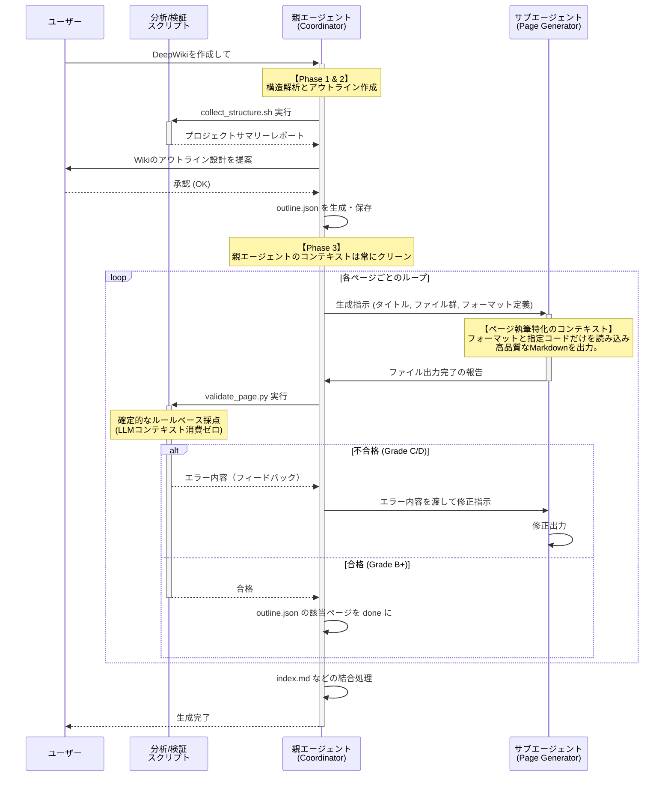

# DeepWiki スキル 全体アーキテクチャと設計意図

この文書では、`deepwiki` スキルの全体構成と、各コンポーネントがどのように連携してドキュメントを生成するのか、そして **「なぜそのような設計（LLMとスクリプトの併用、サブエージェントの活用など）になっているのか」** について解説します。

## 1. 全体アーキテクチャの概要

`deepwiki` スキルは、単一の巨大なLLMプロセス（プロンプト）ですべてを処理するのではなく、**「確定的なプログラム（ツール/スクリプト）」** と **「役割を分割した複数のLLMエージェント」** を協調させるハイブリッドなアーキテクチャを採用しています。

大きく分けて以下の4つのコンポーネントから構成されます。

1. **親エージェント (Coordinator / `SKILL.md`)**
   - **役割**: 全体の司令塔。分析結果に基づくWiki構造の設計（目次の作成）、ユーザーとの合意形成、サブエージェントへの個別の執筆指示、および全体の進行管理を行います。
2. **構造抽出スクリプト (Analyzer / `collect_structure.sh` など)**
   - **役割**: 対象リポジトリのディレクトリ構成、言語ごとのファイル統計、依存関係（import/exportマップ）、関数シグネチャなどをプログラム的に抽出し、サマリーテキストとして出力します。
3. **特化型サブエージェント (Page Generator / `deepwiki-page-generator.md`)**
   - **役割**: 親から渡された「タイトル」「関連ファイル一覧」「フォーマット定義」に基づき、品質基準に厳格に従った1ページ分のMarkdownを執筆し、直接ファイルを出力します。
4. **品質検証スクリプト (Validator / `validate_page.py`)**
   - **役割**: サブエージェントが出力したファイルの品質（文字数、Mermaid図の有無、スニペットの数など）を確定的なルールで採点し、合格かリトライが必要かを判定します。

---

## 2. フェーズごとの処理フローと設計意図

全体のプロセスは4つのフェーズに分かれて進行します。各フェーズにはLLMの制約を回避するための明確な設計意図があります。

### Phase 1: 構造分析 (Structure Analysis)
- **処理**: 親エージェントが `collect_structure.sh` を実行します。このシェルスクリプトは、ファイルツリーの取得に加え、内部でPythonスクリプトを呼び出して依存関係マップや主要関数の抽出を自動で行います。
- **意図**: LLMが自力で何百ものファイルを開きながら全体の繋がりを理解しようとすると、膨大なコンテキストを消費し、見落としも発生します。**「全体の機械的な構造把握」は得意なプログラム（スクリプト）に任せる**ことで、LLMはスクリプトが生成した「高密度な要約レポート」だけを短時間で読み込み、コンテキストを大幅に節約できます。

### Phase 2: Wiki 構造設計 (Wiki Structure Design)
- **処理**: Phase 1の要約レポートをもとに、親エージェントがWiki全体のページ構成（アウトライン）を設計し、ユーザーに提案・合意を得ます。合意後、進捗管理ファイルとして `outline.json` を出力します。
- **意図**: ユーザーとの対話（ヒューマンインザループ）を挟むことで、出力の方向修正を可能にします。また、JSONファイルで状態を管理することで、途中で処理が中断しても再開可能な堅牢性を持たせています。

### Phase 3: ページ単位の生成ループ (Page Generation Loop)
- **処理**: 親エージェントが `outline.json` の各ページについて、**サブエージェント (`deepwiki-page-generator`)** を呼び出して執筆を委譲します。生成されたファイルは **検証スクリプト (`validate_page.py`)** で採点され、合格基準に達するまでサブエージェントを通じた修整ループが回ります。
- **意図**: 
  1. **サブエージェントによる特化と汚染防止**: 親エージェントに自ら何万文字ものMarkdownを書かせると、記憶の混濁（ハルシネーション）が爆発します。そこで、「今書く1ページに必要な2〜3個のファイル」だけしか知らない真っ新な状態のサブエージェントを都度呼び出すことで、関係のない情報によるブレを排除します。
  2. **スクリプトによる品質検証**: 検証処理をLLM自身に行わせると、さらにコンテキストを消費してしまいます。「文字数」や「特定の記法の有無」といった定量的なルール評価はプログラムに行わせるのが最も確実で低コストです。

### Phase 4: 結合・整形 (Assembly)
- **処理**: 全ページの生成が完了した後、インデックスページ（`index.md`）を作成し、全体の結合を行って完了報告をします。

---

## 3. 全体の処理フロー図

上記のプロセスとコンテキストの分離状態を可視化すると以下のようになります。

---

## 4. 総括（ハイブリッドアーキテクチャの真の目的）

本スキルのアーキテクチャの根底にあるのは、LLMエージェント開発における最も重要な課題 **「コンテキスト汚染（Context Pollution）の防止」** と **「トークン消費によるレイテンシやコストの削減」** です。

単一のLLMプロセスに「全コードを読め」「構造を作れ」「全本文を書け」「自分でチェックしろ」と全てを要求する素朴なアプローチでは、会話履歴が無尽蔵に膨張し、最終的に破綻します。

これに対し `deepwiki` スキルは：
- 集計・抽出・検証といった **「確定的 (Deterministic) なタスク」は Bash/Pythonスクリプト** へ。
- 推論・要約・設計といった **「確率的 (Probabilistic) な全体マネジメント」は 親エージェント** へ。
- 強力なフォーマット拘束と抽出された情報を元にした **「高品質なコンテンツ生成」は サブエージェント** へ。

このように、適材適所でツール（プログラム）とLLM（親・子）を組み合わせることで、**大規模なコードベースに対しても、高いスケール性能と安定した出力品質を維持できるベストプラクティス**となっています。
