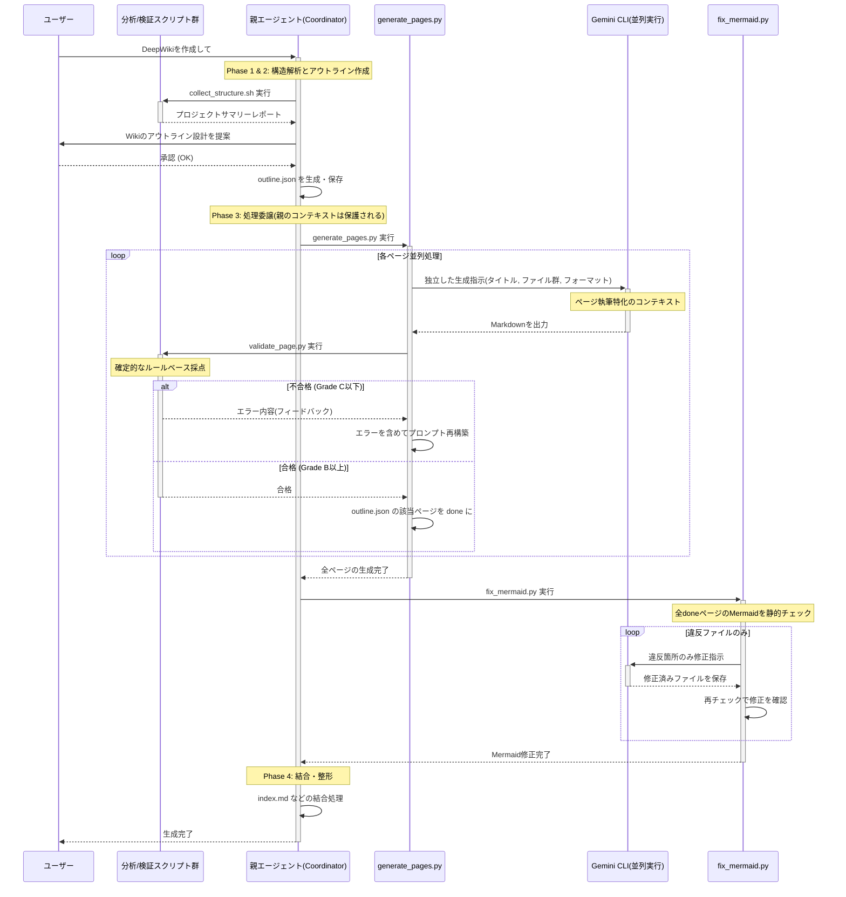

# DeepWiki スキル 全体アーキテクチャと設計意図

この文書では、`deepwiki` スキルの全体構成と、各コンポーネントがどのように連携してドキュメントを生成するのか、そして **「なぜそのような設計（LLMとスクリプトの併用、サブエージェントの活用など）になっているのか」** について解説します。

## 1. 全体アーキテクチャの概要

`deepwiki` スキルは、単一の巨大なLLMプロセス（プロンプト）ですべてを処理するのではなく、**「確定的なプログラム（ツール/スクリプト）」** と **「役割を分割した複数のLLMエージェント」** を協調させるハイブリッドなアーキテクチャを採用しています。

大きく分けて以下の4つのコンポーネントから構成されます。

1. **親エージェント (Coordinator / `SKILL.md`)**
   - **役割**: 全体の司令塔。分析結果に基づくWiki構造の設計（目次の作成）、ユーザーとの合意形成、サブエージェントへの個別の執筆指示、および全体の進行管理を行います。
2. **構造抽出スクリプト (Analyzer / `collect_structure.sh` など)**
   - **役割**: 対象リポジトリのディレクトリ構成、言語ごとのファイル統計、依存関係（import/exportマップ）、関数シグネチャなどをプログラム的に抽出し、サマリーテキストとして出力します。
3. **並列生成スクリプト (Page Generator Script / `generate_pages.py`)**
   - **役割**: 親エージェントから処理を委譲され、複数のページ生成を並行して実行するPythonスクリプト。動的に特化プロンプトを構築して独立した `gemini` CLIプロセスを呼び出し、ページの執筆を制御します。
4. **品質検証スクリプト (Validator / `validate_page.py`)**
   - **役割**: 生成されたファイルの品質（文字数、Mermaid図の有無、スニペットの数など）を確定的なルールで採点し、合格かリトライが必要かを判定します。`generate_pages.py` の自己修正ループ内で利用されます。
5. **Mermaid修正スクリプト (Mermaid Fixer / `fix_mermaid.py`)**
   - **役割**: 全ページ生成完了後に各Markdownファイルを走査し、Mermaidダイアグラムのルール違反（LRレイアウト、ノードIDのハイフン、括弧の未クォートなど）を正規表現で静的チェックします。違反が検出されたファイルのみ Gemini CLI を呼び出して違反箇所だけを修正し、修正後に再チェックして確認します。

---

## 2. フェーズごとの処理フローと設計意図

全体のプロセスは4つのフェーズに分かれて進行します。各フェーズにはLLMの制約を回避するための明確な設計意図があります。

### Phase 1: 構造分析 (Structure Analysis)
- **処理**: 親エージェントが `collect_structure.sh` を実行します。このシェルスクリプトは、ファイルツリーの取得に加え、内部でPythonスクリプトを呼び出して依存関係マップや主要関数の抽出を自動で行います。
- **意図**: LLMが自力で何百ものファイルを開きながら全体の繋がりを理解しようとすると、膨大なコンテキストを消費し、見落としも発生します。**「全体の機械的な構造把握」は得意なプログラム（スクリプト）に任せる**ことで、LLMはスクリプトが生成した「高密度な要約レポート」だけを短時間で読み込み、コンテキストを大幅に節約できます。

### Phase 2: Wiki 構造設計 (Wiki Structure Design)
- **処理**: Phase 1の要約レポートをもとに、親エージェントがWiki全体のページ構成（アウトライン）を設計し、ユーザーに提案・合意を得ます。合意後、進捗管理ファイルとして `outline.json` を出力します。
- **意図**: ユーザーとの対話（ヒューマンインザループ）を挟むことで、出力の方向修正を可能にします。また、JSONファイルで状態を管理することで、途中で処理が中断しても再開可能な堅牢性を持たせています。

### Phase 3: ページ単位の並列生成・自己修正・Mermaid修正 (Parallel Generation, Self-Correction & Mermaid Fix)
- **処理**: 親エージェントが `outline.json` の作成後、統合スクリプト (`generate_pages.py`) に以後の処理を委譲します。このスクリプトは未完了ページを抽出し、内部で個別の `gemini` プロセスを立ち上げて執筆を並列に行います。生成後は自動で **検証スクリプト (`validate_page.py`)** を呼び出し、合格基準に達するまでプログラム制御による修整ループが回ります。全ページ完了後、**Mermaid修正スクリプト (`fix_mermaid.py`)** を実行してダイアグラムのルール違反を一括修正します。
- **意図**:
  1. **並列処理による高速化**: 複数ページを同時に生成させることで、処理完了までの時間を劇的に短縮します。
  2. **コンテキストの分離と汚染防止**: 「今書く1ページに必要な2〜3個のファイルとフォーマット」だけをプロンプトとして構築し、完全に独立した生成プロセスに渡すことで、無関係な情報によるハルシネーションを排除します。
  3. **確実な自己修正と安定運用**: スクリプトが検証結果を判定し、タイムアウトや最大制限付きの再実行ループを回すため、LLM自身の自律的なツール実行に頼るよりも安定し、スタックや無限ループを防止できます。
  4. **Mermaid品質の後処理保証**: 生成時のプロンプト指示だけでは守り切れないMermaidルール違反を、全ページ完了後に正規表現で静的チェックして確実に修正します。違反のないページはスキップするため、余分なGemini呼び出しは発生しません。

### Phase 4: 結合・整形 (Assembly)
- **処理**: 全ページの生成・Mermaid修正が完了した後、インデックスページ（`index.md`）を作成し、全体の結合を行って完了報告をします。

---

## 3. 全体の処理フロー図

上記のプロセスとコンテキストの分離状態を可視化すると以下のようになります。

```mermaid
sequenceDiagram
    participant User as ユーザー
    participant Script1 as 分析/検証スクリプト群
    participant Main as 親エージェント(Coordinator)
    participant GenScript as generate_pages.py
    participant Gemini as Gemini CLI(並列実行)
    participant MermaidFix as fix_mermaid.py

    User->>+Main: DeepWikiを作成して

    Note over Main: Phase 1 & 2: 構造解析とアウトライン作成
    Main->>+Script1: collect_structure.sh 実行
    Script1-->>-Main: プロジェクトサマリーレポート
    Main->>User: Wikiのアウトライン設計を提案
    User-->>Main: 承認 (OK)
    Main->>Main: outline.json を生成・保存

    Note over Main: Phase 3: 処理委譲(親のコンテキストは保護される)
    Main->>+GenScript: generate_pages.py 実行

    loop 各ページ並列処理
        GenScript->>+Gemini: 独立した生成指示(タイトル, ファイル群, フォーマット)
        Note over Gemini: ページ執筆特化のコンテキスト
        Gemini-->>-GenScript: Markdownを出力

        GenScript->>+Script1: validate_page.py 実行
        Note over Script1: 確定的なルールベース採点

        alt 不合格 (Grade C以下)
            Script1-->>GenScript: エラー内容(フィードバック)
            GenScript->>GenScript: エラーを含めてプロンプト再構築
        else 合格 (Grade B以上)
            Script1-->>-GenScript: 合格
            GenScript->>GenScript: outline.json の該当ページを done に
        end
    end

    GenScript-->>-Main: 全ページの生成完了

    Main->>+MermaidFix: fix_mermaid.py 実行
    Note over MermaidFix: 全doneページのMermaidを静的チェック
    loop 違反ファイルのみ
        MermaidFix->>+Gemini: 違反箇所のみ修正指示
        Gemini-->>-MermaidFix: 修正済みファイルを保存
        MermaidFix->>MermaidFix: 再チェックで修正を確認
    end
    MermaidFix-->>-Main: Mermaid修正完了

    Note over Main: Phase 4: 結合・整形
    Main->>Main: index.md などの結合処理
    Main-->>-User: 生成完了
```

---

## 4. 総括（ハイブリッドアーキテクチャの真の目的）

本スキルのアーキテクチャの根底にあるのは、LLMエージェント開発における最も重要な課題 **「コンテキスト汚染（Context Pollution）の防止」** と **「トークン消費によるレイテンシやコストの削減」** です。

単一のLLMプロセスに「全コードを読め」「構造を作れ」「全本文を書け」「自分でチェックしろ」と全てを要求する素朴なアプローチでは、会話履歴が無尽蔵に膨張し、最終的に破綻します。

これに対し `deepwiki` スキルは：
- 集計・抽出・検証・プロセス制御といった **「確定的 (Deterministic) なタスク」は Bash/Pythonスクリプト** へ。
- 推論・要約・設計といった **「確率的 (Probabilistic) な全体マネジメント」は 親エージェント** へ。
- 並行スクリプトから呼び出される極小化された独立プロセスへの委譲による **「高品質かつ高速なコンテンツ生成」** の実現。

このように、適材適所でツール（プログラム）とLLM（親・子）を組み合わせることで、**大規模なコードベースに対しても、高いスケール性能と安定した出力品質を維持できるベストプラクティス**となっています。
