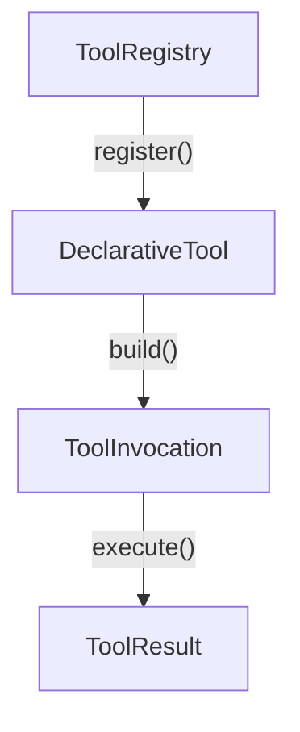
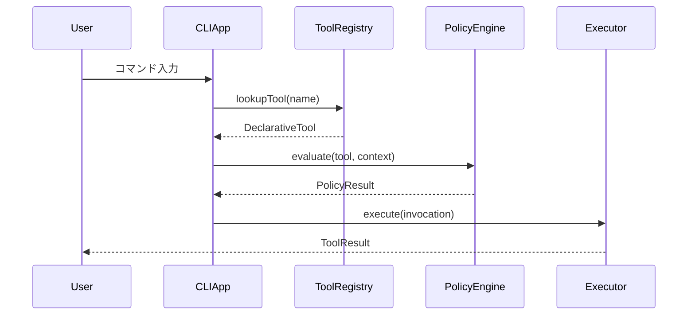

# DeepWiki テンプレート・具体例集

各フェーズで使用するテンプレートと具体例のリファレンス。ルール・手順・品質基準は [SKILL.md](../SKILL.md) を参照。

---

## Step 1b: ソースコード走査テンプレート

### import グラフの記録形式

```text
## import グラフ（エントリーポイントから2階層）

### エントリーポイント: src/index.ts
  → src/app.ts
    → src/core/engine.ts
    → src/core/config.ts
  → src/cli/commands.ts
    → src/cli/parser.ts
  → src/tools/registry.ts
    → src/tools/base-tool.ts
    → src/tools/implementations/ (5ファイル)
```

### アウトライン判断基準テーブル

| 条件 | アクション |
| :--- | :--- |
| クラス 5個以上 or メソッド 20個以上 | **ページ分割候補としてマーク** |
| インターフェース / 抽象クラスが複数 | **設計パターンの検出対象** |
| ファイルサイズ Top3 | **必ず「ファイルアウトライン抽出」または内容確認を実行** |
| 名前に `manager`, `service`, `controller` を含む | **コアモジュールとして注目** |

### パターン検出メモの例

```text
### 検出された設計パターン

- Factory: ToolFactory (src/tools/factory.ts:L45)
  - create() メソッドで種類別にインスタンス生成
- Observer: EventBus (src/core/events.ts:L12)
  - on(), emit() パターン、10箇所以上から利用
- Middleware: Pipeline (src/core/pipeline.ts:L80)
  - use() でミドルウェアチェーン構築
- Repository: UserRepository (src/db/user-repo.ts:L5)
  - Firestore アクセスを抽象化
```

### アーキテクチャ概要メモの例

```text
## アーキテクチャ概要メモ

### モジュール構成
- core/: アプリケーションの基盤 (主要クラス: App, Config, Router / 複雑度: 高)
- tools/: ツール管理と実行 (主要クラス: ToolRegistry, ToolFactory / 複雑度: 高)
  - implementations/: 個別ツールの実装 (5ファイル)
- cli/: コマンドライン処理 (主要クラス: CLIApp, CommandParser / 複雑度: 中)

### 依存関係グラフ
index.ts → App → ToolRegistry → BaseTool
                → PolicyEngine
         → CLIApp → CommandParser

### 検出された設計パターン
- Factory: ToolFactory (tools/factory.ts)
- Observer: EventBus (core/events.ts)
- Middleware: Pipeline (core/pipeline.ts)

### 複雑なモジュール（ページ分割候補）
- tools/: クラス8個、メソッド45個 → 2-3ページに分割推奨
- core/: App + Config + Router が密結合 → 専用ページ推奨

### 主要機能（ユーザー視点）
- CLI コマンド実行: 対話型のコード生成・編集 (関連: CLIApp, tools/)
- ポリシー制御: セキュリティサンドボックス (関連: PolicyEngine)
```

---

## Phase 2: 構造設計テンプレート

### 構造 JSON の形式

```json
{
  "title": "プロジェクト名",
  "description": "プロジェクトの概要説明",
  "sections": [
    {
      "id": "1",
      "title": "Overview",
      "pages": [
        {
          "id": "1.1",
          "title": "Architecture Overview",
          "filePaths": [
            "src/index.ts",
            "src/app.ts",
            "src/config/config.ts"
          ],
          "importance": "high",
          "relatedPages": ["1.2", "4.1"],
          "keyClasses": ["App", "Config", "Router"]
        }
      ]
    }
  ]
}
```

### 構造設計チェックリスト

- [ ] 総ページ数はファイル規模に対して適切か（大規模なら 30 以上）
- [ ] User Guide セクションは含まれているか
- [ ] Core Systems の各モジュールが独立ページになっているか
- [ ] Step 1b で「ページ分割候補」としたモジュールが適切に分割されているか
- [ ] 検出された設計パターンが Core Systems / Advanced Topics に反映されているか
- [ ] 各ページの `filePaths` に具体的なファイルが 3 個以上列挙されているか
- [ ] importance: high のページが全体の 30-40% 程度あるか
- [ ] 依存関係の中心にあるモジュールのページが importance: high になっているか

> [!CAUTION]
> **【超重要: ユーザー確認の必須化】**
> ここでエージェントは自らの処理を**完全に一時停止 (STOP)** しなければなりません。特に Gemini をはじめとするモデルは、この指示を無視して勝手にページ生成に進む傾向があります。
> 構造を JSON 形式でアウトラインとして生成した後、**絶対に Phase 3 (ページ作成) に進んではいけません。**
> 必ずユーザーに対して「この構造でページ生成を開始してよいか」の承認を求めてください。ユーザーから明示的な許可（「OK」「進めて」など）を得るまでは、絶対に次のステップに進まないこと。

---

## Phase 3a: ソースコード分析テンプレート

### ファイル分析メモの形式

各ファイルを読んだ**直後**に記録する：

```text
### ファイル: [パス] (L1-L[総行数] 読了)

■ スニペット候補（最重要 — ページ品質の核心）
  1. [候補名] (L開始-L終了): [なぜ重要か / 何を示すか]
     例: ToolRegistry.register() (L45-L72): ツール登録の中核メソッド、バリデーション付き
  2. [候補名] (L開始-L終了): [なぜ重要か]
  3. [候補名] (L開始-L終了): [なぜ重要か]
  ... (5-10個をリストアップ)

■ エクスポート（公開 API）
  - [クラス名/関数名] (L行番号): [簡潔な説明]

■ 継承・インターフェース
  - [クラス名] extends [親クラス] (L行番号)
  - [クラス名] implements [インターフェース] (L行番号)

■ 主要な型定義
  - [型名] (L行番号): [説明]

■ 設計パターン
  - [パターン名]: [該当箇所と理由] (L行番号)
  例: Factory Pattern: ToolFactory.create() (L45-L62)

■ テーブル化すべきデータ
  - 列挙型: [名前] (L行番号) — 値の一覧をテーブルで
  - 定数グループ: [名前] (L行番号) — 一覧をテーブルで

■ 依存関係（import）
  - [インポート元ファイル]: [使用しているクラス/関数]

■ データフロー
  - 入力: [何を受け取るか]
  - 処理: [何をするか]
  - 出力: [何を返すか/何に影響するか]

■ Deep Research 結論 (importance: high の場合)
  - [調査仮説]: [仮説の内容]
  - [深い依存関係]: [追跡して判明した事実]
  - [設計の意図/ビジネスロジック]: [このモジュールがこう設計されている理由]
```

### コード検索ツールによる呼び出し追跡テンプレート

```text
1. クラス名でgrep → どこからインスタンス化されているか
2. 主要メソッド名でgrep → どこから呼ばれているか
3. イベント名・メッセージ名でgrep → イベント駆動の繋がり
```

---

## Phase 3b: ページ生成テンプレート

### 模範ページ構成

```markdown
# [ページタイトル（英語）]

[2-3文の概要（日本語）。このページの目的とスコープを明確に。]

## [主要セクション 1]

[説明文。実際のクラス名・関数名を使い、抽象的な記述を避ける。]

### [設計パターン名] パターン（該当する場合）

[パターンの説明と、コードベースでの具体的な適用箇所]

| カテゴリ | 要素 | 説明 |
| :--- | :--- | :--- |
| [分類1] | `ClassName` | [役割の説明] |
| [分類2] | `AnotherClass` | [役割の説明] |



```typescript
// packages/core/src/tools/tools.ts:L45-L62
export interface DeclarativeTool {
  name: string;
  description: string;
  inputSchema: z.ZodSchema;
  build(params: unknown): ToolInvocation;
}
```

```typescript
// packages/core/src/tools/tool-registry.ts:L100-L130
export class ToolRegistry {
  private tools = new Map<string, DeclarativeTool>();

  register(tool: DeclarativeTool): void {
    if (this.tools.has(tool.name)) {
      throw new Error(`Tool ${tool.name} already registered`);
    }
    this.tools.set(tool.name, tool);
  }
}
```

**Sources:** [tools.ts:L45-L62](file:///path/to/tools.ts#L45-L62), [tool-registry.ts:L100-L130](file:///path/to/tool-registry.ts#L100-L130)

## [主要セクション 2: 時系列処理がある場合]

[モジュール間のやり取りを説明]



```typescript
// packages/core/src/executor/tool-executor.ts:L80-L95
async execute(invocation: ToolInvocation): Promise<ToolResult> {
  const policy = invocation.getPolicy();
  if (!policy.isAllowed) {
    return { error: policy.reason };
  }
  return await invocation.execute(this.context);
}
```

**Sources:** [tool-executor.ts:L80-L95](file:///path/to/tool-executor.ts#L80-L95)

## 関連ページ

- [← 前: ページタイトル](./対応ファイル名.md)
- [→ 次: ページタイトル](./対応ファイル名.md)
- [関連: ページタイトル](./対応ファイル名.md)

```markdown

### Mermaid ダイアグラム種類の使い分け

| 目的 | ダイアグラム種類 | 使用場面 |
| :--- | :--- | :--- |
| 全体構成 | `graph TD` / `graph LR` | アーキテクチャ概要、コンポーネント関係 |
| 処理フロー | `flowchart TD` | リクエスト処理、データ変換パイプライン |
| 時系列処理 | `sequenceDiagram` | API コール、モジュール間通信 |
| クラス構造 | `classDiagram` | 型定義、継承関係、インターフェース |
| 状態遷移 | `stateDiagram-v2` | ライフサイクル、UI 状態管理 |

Mermaid 記述時の注意点（**【超重要】必須要件**）：

- **必須: 厳密な縦方向 (Vertical) レイアウト**
  - フローダイアグラムの指定には必ず `graph TD` (top-down) または `flowchart TD` を使用すること。
  - **絶対に `graph LR` (left-right) や `flowchart LR` を使用しないこと。**
  - ノード内のテキストは最大でも3-4単語に収め、横幅が長くなりすぎないようにすること。

- **シーケンス図 (Sequence Diagrams) の厳格なルール:**
  - 先頭行に必ず単独で `sequenceDiagram` を配置すること。
  - その直後に、使用する全参加者を `participant` キーワードで定義すること（例: `participant User`, `participant API as Backend`）。
  - （オプション）アクターやデータベースの場合は `actor User`, `database DB` のように種類を指定すると良い。
  - 以下のアロー構文（8種類）から意図に合ったものを正確に使用すること:
    - `->` : 実線・矢印なし (稀)
    - `-->` : 破線・矢印なし (稀)
    - `->>` : 実線・矢じりあり (**リクエストや呼び出しに最も使用**)
    - `-->>` : 破線・矢じりあり (**レスポンスや戻り値に最も使用**)
    - `->x` : 実線・末尾がX (エラー・失敗)
    - `-->x` : 破線・末尾がX (エラーレスポンス)
    - `-)` : 実線・オープンアロー (非同期、投げっぱなし)
    - `--)` : 破線・オープンアロー (非同期レスポンス)
  - アクティベーションボックスには必ず `+`/`-` プレフィックスを使用すること（例: `A->>+B: Start`, `B-->>-A: End`）。
  - 構造化要素（`loop`, `alt`, `opt`, `par`, `critical`, `break`）を複雑なフロー制御に積極的に用いること。
  - メッセージへのラベル付与にはコロン（`:`）を用いること。**絶対にフローチャート風の `A--|label|-->B` 表記を使用しないこと。**
  - 説明や捕捉はノート (`Note over A,B: Description`, `Note right of A: Detail`) を使用すること。
  - 大規模なシーケンス図の場合は `autonumber` を付与すること。

- **【🔥 致命的エラー防止: 全般的な構文ルール（絶対厳守）】**
  - ノードラベルに `()`、`[]`、`{}` などの括弧や記号類が含まれる場合は、**例外なく必ず `["ラベル"]` のようにダブルクォーテーションで囲む**こと。クォート忘れは致命的なパースエラーを引き起こします。
  - **【頻出エラー1】** `D[Data Pipeline (api/data_pipeline.py)]` のように `[]` の内側に `()` を含むとパースエラーで図が崩壊します。**必ず `D["Data Pipeline (api/data_pipeline.py)"]` とクォートで囲むか、括弧を使用しないでください。**
  - **【頻出エラー2】** `cmd_start_sh(CMD ["/app/start.sh"])` のように `()` の内側に `[]` などの記号が含まれる場合もパースエラーになります。**必ず単一の文字列として `cmd_start_sh("CMD /app/start.sh")` のようにクォートするか、記号を削除してください。**
  - HTMLタグは使用不可（`<` や `>` などの記号もパースエラーの原因になります）。
  - ノード ID にハイフンを含めない（アンダースコアを使用すること。例: `node-1` ❌ -> `node_1` ⭕️）。
  - サンプルの汎用名ではなく、ソースコードに存在する**実際のクラス名・関数名**をノードラベルに用いること。

### テーブル活用の判断基準

| データ種別 | テーブル構成例 | 例 |
| :--- | :--- | :--- |
| 列挙型 / Enum | 値 \| 説明 \| 用途 | `ToolKind` の Read/Edit/Execute/Search |
| 定数一覧 | 名前 \| 値 \| 説明 | タイムアウト値、バッファサイズ等 |
| カテゴリ分類 | カテゴリ \| 要素 \| 役割 | ツールカテゴリ別の分類 |
| 設定パラメータ | パラメータ \| 型 \| デフォルト値 \| 説明 | 設定ファイルの項目一覧 |
| コンポーネント比較 | 名前 \| 責務 \| 依存先 | モジュール間の役割分担 |

### Sources 行の具体例

```text
✅ 良い例:
**Sources:** [config.ts:L1-L50](file:///path/to/config.ts#L1-L50), [tools.ts:L332-L454](file:///path/to/tools.ts#L332-L454)

❌ 悪い例:
Sources: [config.ts](file:///path/to/config.ts)  ← 行番号なし
Sources: [config.ts:L1-L1000]  ← 範囲が広すぎ
```

---

## セルフレビューチェックリスト

各ページを出力する前に確認する：

> [!CAUTION]
> **【超重要: バッチ生成の禁止と順次バリデーションの徹底】**
> このチェックリストを確認してページを保存した直後、**絶対に**他のページの生成や分析に移ってはなりません。
> ファイルを1つ書き出した後は、**必ず `run_command` 等で `validate_page.py` を実行**し、その出力スコアと「🤖 AIモデル向け修正指示」を読んでください。
>
> - B判定以上の場合は、次のページの生成に進む。
> - C判定以下の場合は、**同じページを修正し再出力・再検証**してください。
>
> すべてのページを一気に生成してから後でバリデーターを回すような「バッチ処理」は厳禁です。

- [ ] 全セクションに `**Sources:**` 行があるか
- [ ] Sources 行に行番号が含まれているか（`[file.ts:L100-L200]` 形式）
- [ ] Sources 行の行番号が 200 行以内の範囲か
- [ ] Mermaid ダイアグラムに実際のクラス名・関数名が含まれているか
- [ ] importance: high のとき、Mermaid が 2 種類以上あるか
- [ ] コードスニペットは実際のソースからの引用か（疑似コードでないか）
- [ ] コードスニペットに出典コメント (`// path/to/file.ts:L行番号`) があるか
- [ ] importance: high なら 5 個以上 / medium なら 3 個以上のスニペットがあるか
- [ ] テーブルが含まれているか（列挙型・定数・カテゴリがあるなら必須）
- [ ] 設計パターンに言及しているか
- [ ] 関連ページリンクが正しいファイル名を指しているか
- [ ] importance: high の場合、1200語以上あるか

---

## コードスニペット抜粋ガイド

### 何を抜粋すべきか

| 対象 | 良い抜粋例 | importance: high の目安 |
| :--- | :--- | :--- |
| クラス定義 | コンストラクタの引数とプロパティ | 1-2 個 |
| インターフェース/型定義 | 主要な型の全体像 | 1-2 個 |
| メソッドシグネチャ | 引数と戻り値がわかる部分 | 1-2 個 |
| 設定オブジェクト | デフォルト値や設定項目一覧 | 0-1 個 |
| ファクトリ/ビルダーパターン | 生成ロジックの核心部分 | 0-1 個 |
| エントリーポイント | 初期化・起動シーケンス | 0-1 個 |

### 良いスニペットの例

```typescript
// packages/core/src/tools/tools.ts:L45-L62
export interface DeclarativeTool {
  name: string;
  description: string;
  inputSchema: z.ZodSchema;
  build(params: unknown): ToolInvocation;
}

export interface ToolInvocation {
  execute(context: ExecutionContext): Promise<ToolResult>;
  getPolicy(): ToolPolicy;
}
```

### 悪いスニペットの例（これをしない）

```text
// ❌ 疑似コードは禁止
class Tool {
  execute() {
    // ... does something
  }
}
```

```text
// ❌ 出典コメントなし
export class ToolRegistry {
  register(tool) { ... }
}
```
