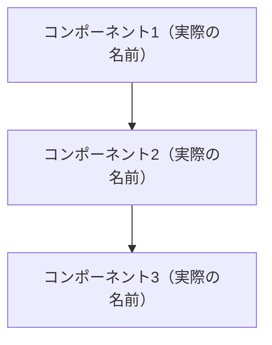
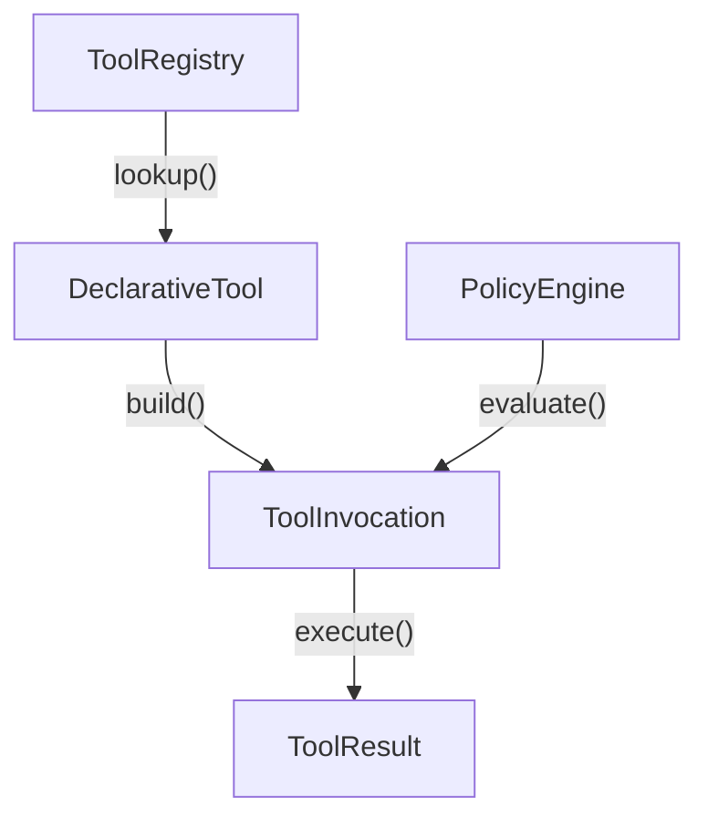
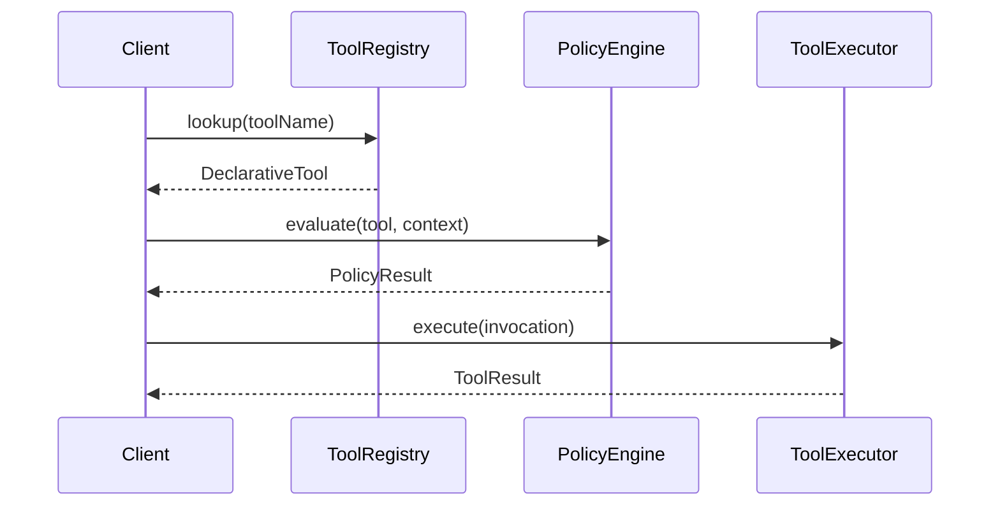

# DeepWiki 出力フォーマット仕様

## ファイル命名規則

```
<番号>-<kebab-case-title>.md
```

例:
- `index.md` - メインインデックス
- `1-overview.md` - セクションページ
- `1.1-architecture-overview.md` - サブページ
- `1.2-project-structure.md`
- `2-getting-started.md`
- `3.1-interactive-mode.md`
- `4.6-tool-system-architecture.md`

---

## 6セクション構成テンプレート

以下を基本形とし、対象コードベースに応じて調整する。

### セクション定義と最小ページ数

| セクション | 最小ページ数 | 内容 |
| :--- | :--- | :--- |
| 1. Overview | 2-3 | プロジェクト概要、アーキテクチャ、パッケージ構成 |
| 2. Getting Started | 2-4 | インストール、認証、設定 |
| 3. User Guide | 3-12 | ユーザー向け機能（コマンド、UI、操作方法等） |
| 4. Core Systems | 5-12 | 内部アーキテクチャの主要モジュール |
| 5. Advanced Topics | 2-8 | 拡張性、セキュリティ、可観測性、プラグイン等 |
| 6. Development | 2-3 | 開発環境、ビルド、テスト |

> **Core Systems と User Guide がページ数の大部分を占める。** 合わせて総ページ数の 50-60% 程度になるのが正常。

### セクション間のクロスリファレンス

各セクションの関連性を意識してリンクを張る：

```
Overview ──→ Core Systems（アーキテクチャの詳細は 4.x を参照）
Getting Started ──→ User Guide（使い方の詳細は 3.x を参照）
User Guide ──→ Core Systems（内部実装は 4.x を参照）
User Guide ──→ Advanced Topics（拡張方法は 5.x を参照）
Core Systems ──→ Advanced Topics（プラグイン機構は 5.x を参照）
Advanced Topics ──→ Development（開発手順は 6.x を参照）
```

---

## index.md の構造

```markdown
# [プロジェクト名]

[プロジェクトの概要説明: 何をするプロジェクトか、主要な機能と特徴を2-3段落で]

## 技術スタック

| カテゴリ | 技術 |
|---------|------|
| 言語 | TypeScript, Python 等 |
| フレームワーク | Next.js, FastAPI 等 |
| データベース | PostgreSQL, Redis 等 |
| インフラ | Docker, AWS 等 |

## アーキテクチャ概要



## 目次

### 1. [Overview](./1-overview.md)
- [1.1 Architecture Overview](./1.1-architecture-overview.md)
- [1.2 Package Structure](./1.2-package-structure.md)

### 2. [Getting Started](./2-getting-started.md)
- [2.1 Installation and Setup](./2.1-installation-and-setup.md)
- [2.2 Authentication](./2.2-authentication.md)
- [2.3 Basic Configuration](./2.3-basic-configuration.md)

### 3. [User Guide](./3-user-guide.md)
- [3.1 ...](./3.1-....md)
- ...

### 4. [Core Systems](./4-core-systems.md)
- [4.1 ...](./4.1-....md)
- ...

### 5. [Advanced Topics](./5-advanced-topics.md)
- [5.1 ...](./5.1-....md)
- ...

### 6. [Development](./6-development.md)
- [6.1 Development Setup](./6.1-development-setup.md)
- [6.2 Build System](./6.2-build-system.md)
- [6.3 Testing Infrastructure](./6.3-testing-infrastructure.md)
```

---

## 個別ページの構造（Claude 品質標準）

importance: high のページを基準とした模範テンプレート:

```markdown
# [ページタイトル]

[概要: 2-3文でこのページのスコープを説明。何を解説し、何は別ページかを明記。]

**Sources:** [ソースファイル1:L範囲](file:///パス#L開始-L終了), [ソースファイル2:L範囲](file:///パス#L開始-L終了)

## [セクション1: アーキテクチャ/概要]

[コンポーネントの役割と全体像を説明。実際のクラス名/関数名を使う。]

### [設計パターン名] パターン

[設計パターンの説明と適用箇所]

| カテゴリ | コンポーネント | 責務 |
|:---|:---|:---|
| 定義 | `DeclarativeTool` | ツールのメタデータと入力スキーマ |
| 実行 | `ToolInvocation` | 検証済みの実行可能な呼び出し |
| 管理 | `ToolRegistry` | ツールの登録と検索 |



```typescript
// packages/core/src/tools/tools.ts:L45-L62
export interface DeclarativeTool {
  name: string;
  description: string;
  inputSchema: z.ZodSchema;
  build(params: unknown): ToolInvocation;
}
```

```typescript
// packages/core/src/tools/tool-registry.ts:L100-L130
export class ToolRegistry {
  private tools = new Map<string, DeclarativeTool>();

  register(tool: DeclarativeTool): void {
    this.tools.set(tool.name, tool);
  }
}
```

**Sources:** [tools.ts:L45-L62](file:///path/to/tools.ts#L45-L62), [tool-registry.ts:L100-L130](file:///path/to/tool-registry.ts#L100-L130)

## [セクション2: 処理フロー/実行フロー]

[モジュール間のやり取りを時系列で説明]



```typescript
// packages/core/src/executor/tool-executor.ts:L80-L110
async execute(invocation: ToolInvocation): Promise<ToolResult> {
  const policy = invocation.getPolicy();
  if (!policy.isAllowed) {
    return { error: policy.reason };
  }
  const result = await invocation.execute(this.context);
  return this.postProcess(result);
}
```

**Sources:** [tool-executor.ts:L80-L110](file:///path/to/tool-executor.ts#L80-L110)

## [セクション3: 設定/カテゴリ]

[設定項目やカテゴリ分類を具体的に説明]

| Kind | ツール例 | 説明 |
|:---|:---|:---|
| Read | `read_file`, `list_dir` | ファイルシステムの読み取り |
| Edit | `write_file`, `edit_file` | ファイルの変更 |
| Execute | `run_command` | シェルコマンドの実行 |
| Search | `grep_search` | コード検索 |

```typescript
// packages/core/src/tools/constants.ts:L10-L25
export enum ToolKind {
  Read = 'read',
  Edit = 'edit',
  Execute = 'execute',
  Search = 'search',
  Web = 'web',
}
```

**Sources:** [constants.ts:L10-L25](file:///path/to/constants.ts#L10-L25)

## [セクション4: エッジケース/注意事項]

[エッジケースやエラーハンドリングの説明]

```typescript
// packages/core/src/tools/tools.ts:L200-L220
handleError(error: ToolError): ToolResult {
  if (error instanceof TimeoutError) {
    return { status: 'timeout', message: error.message };
  }
  throw error;
}
```

**Sources:** [tools.ts:L200-L220](file:///path/to/tools.ts#L200-L220)

## 関連ページ

- [← 前: ページタイトル](./previous.md)
- [→ 次: ページタイトル](./next.md)
- [関連: ページタイトル](./related.md)
```

---

## ページ品質の最低要件早見表（Claude 品質標準）

| importance | 語数 | Mermaid | Mermaid 種類 | コードスニペット | Sources 行 | テーブル | セクション数 |
| :--- | :--- | :--- | :--- | :--- | :--- | :--- | :--- |
| **high** | 1200+ | 2-3 | **2種類+** | **5-8** | 全セクション | **1+** | 4-6 |
| **medium** | 600-1000 | 1-2 | 1種類+ | **3-5** | 全セクション | 推奨 | 3-5 |
| **low** | 300-500 | 1 | 1種類+ | 1-2 | 主要セクション | 任意 | 2-3 |

> **目標: 全ページ Grade B (75%) 以上。高品質な Wiki は読者の信頼度を大きく向上させる。**
